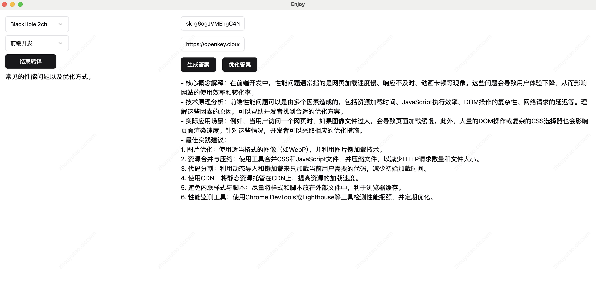
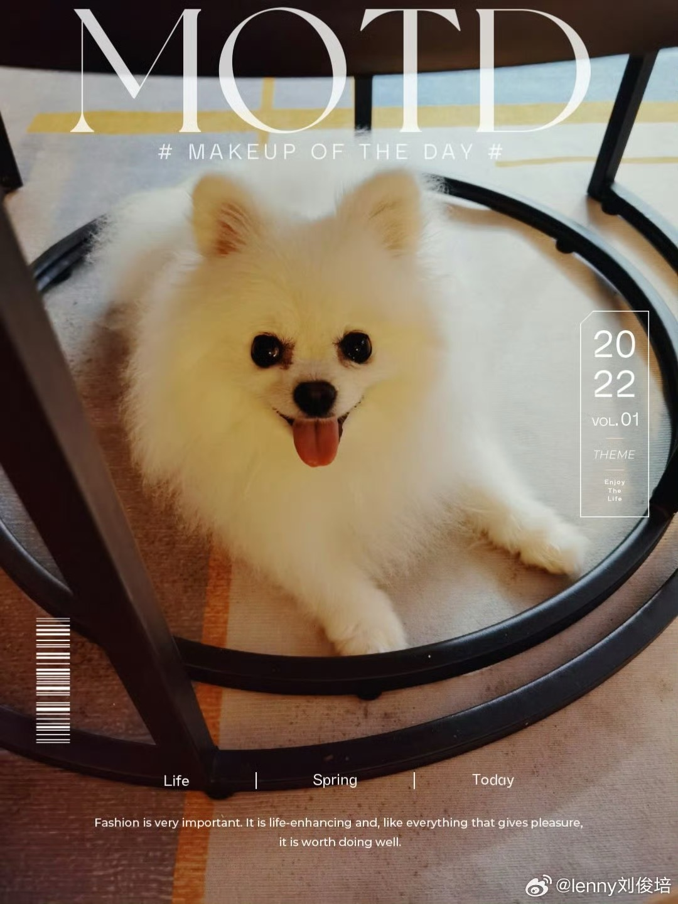

# Interview Copilot App

-blue)


AI面试助手，协助用户进行远程面试，助你摆脱八股文带来的烦恼

## 工作原理

通过`Whisper`本地模型进行实时音频转录，并通过`OpenAI`的`GPT-4o-mini`模型生成答案。



## 安装及使用

下载及使用相关说明，请参阅[文档](./docs/安装及使用.md)。

## 开发

```bash
yarn install
yarn start
```

## 赞赏

- 本项目由兴趣驱使，提升自己的体验，并共享世界。
- 如果你喜欢作者的项目，可以给作者一个免费的Star或者Follow。
- 如果你希望作者的小狗吃到更好的狗粮，欢迎赞赏与激励。

| 我的小狗 | 打赏 | 添加微信 |
| --- | --- | --- |
| </img> | </img> | </img> |
## 免责声明

本项目仅用于学习和研究目的，用户需自行承担使用风险。

## 致谢

该项目的灵感来源于 [leetcode-mafia/cheetah](https://github.com/leetcode-mafia/cheetah)，感谢其提供的优秀想法。

该项目代码和架构参考 [everyone-can-use-english](https://github.com/ZuodaoTech/everyone-can-use-english)实现，感谢其提供优秀的开源代码。


之前通过你发的帖，关注到cheetah这个项目，激发了我开发一款独立应用的idea,后面断断续续进行开发，一直进展缓慢。直到最近看到你关于"垃圾产品"的帖，就下定决心把这款产品开发完了~hhh。项目介绍就在我发的第一条帖，欢迎宝玉老师进行体验，提出使用建议，如果觉得项目不错也请帮忙多多推广，大家的关注是我开源的动力~