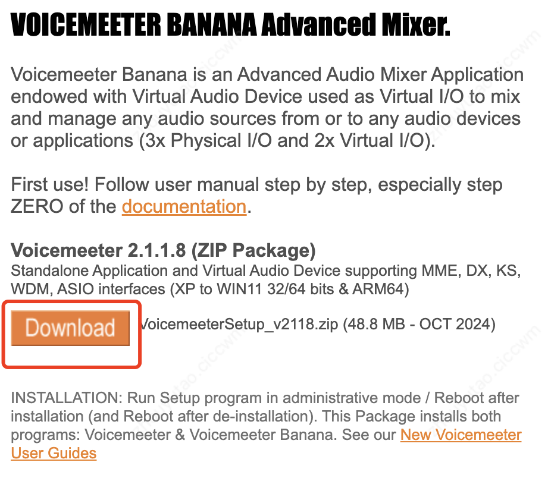
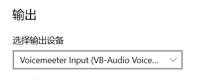
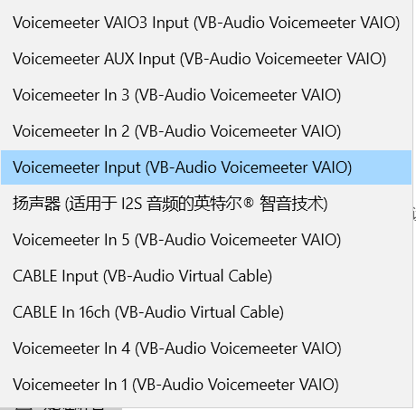
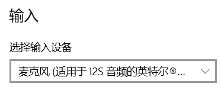
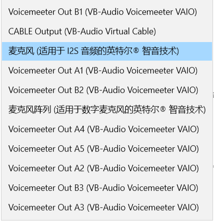
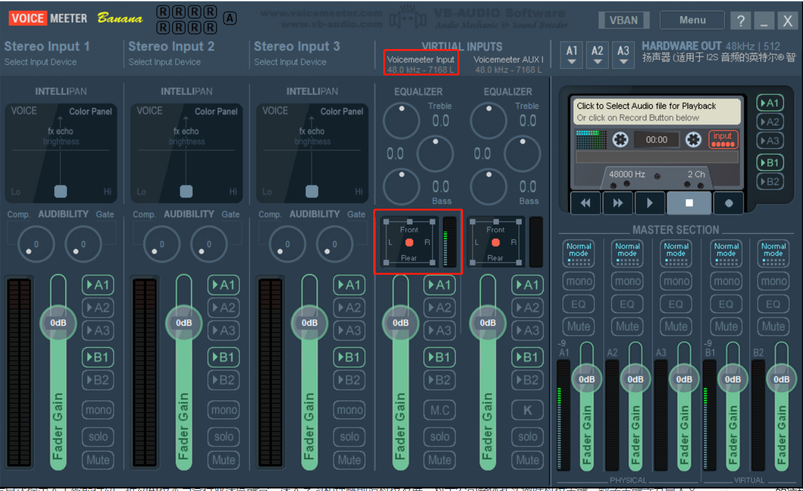
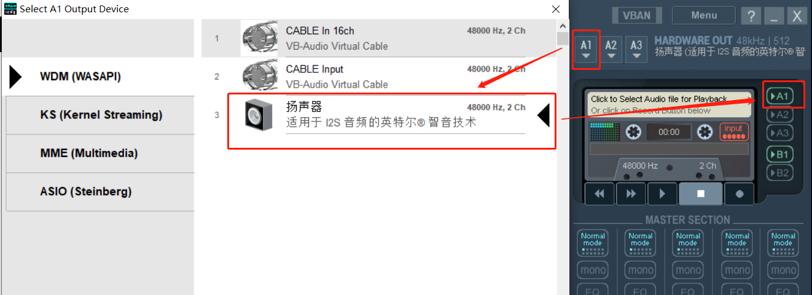
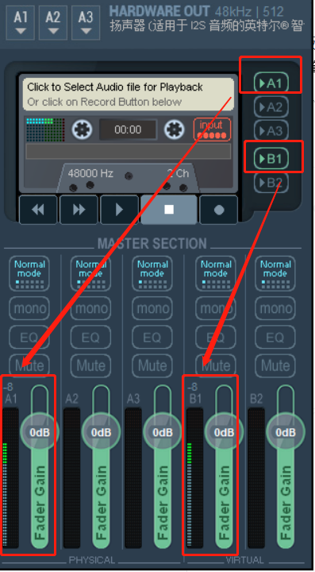

# 音频环回驱动程序设置

1. 下载[Voicemeeter Banana](https://vb-audio.com/Voicemeeter/banana.htm)后进行安装后重启
    

2. 打开`声音设置`，选择`VoiceMeeter Input(VB-Audio Voicemeeter VAIO)`作为输出设备，并选择`麦克风`作为输入设备
    

    
    
    

    

    
    
    

3. 打开`voicemeeter Banner`软件，播发任意音频,检查`VoiceMeeter Input`设备口是否有音频信号

    

4. 把音频路由到多个设备：勾选`A1`，并将把它设置选择为扬声器，同时勾选`B1`，后续可以在`whisper`选择`Voicemeeter Out B1（VB-Audio Voicemeeter VAIO）`作为输入设备

    

5. 播放音频的同时，检查`A1`和`B1`设备口是否有音频信号

    